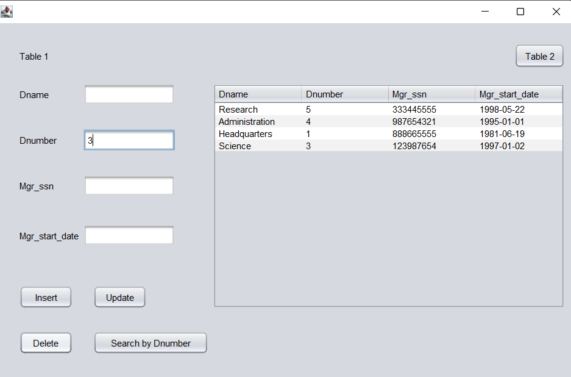
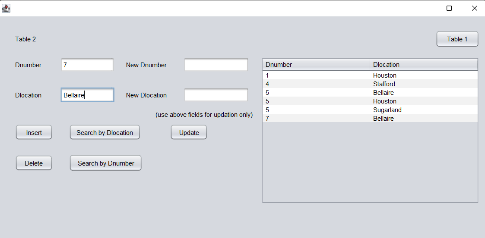

# JDBC_and_CRUD_operations

 

* some of output screenshots are shown :point_up:
#

* Implemented a java code to process insert, update and delete data in a particular table in SQL :point_up:
* All the necessary steps are shown in 19_ENG_041_Assignment_2.pdf
